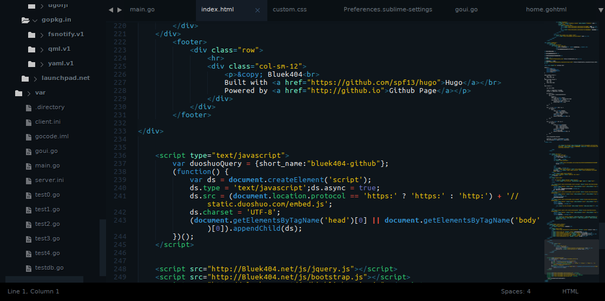
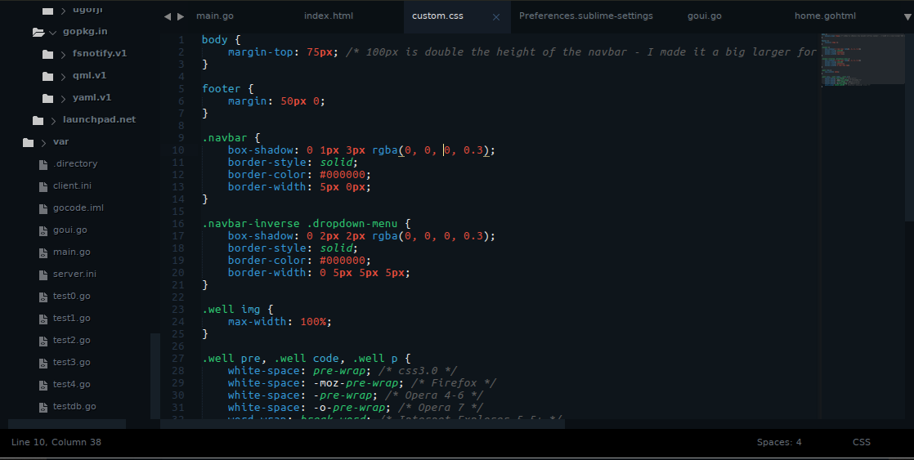
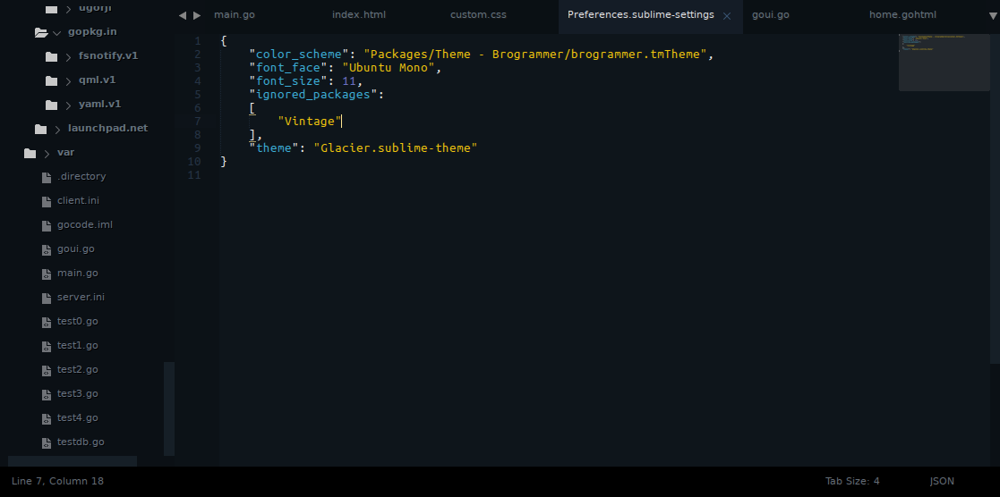
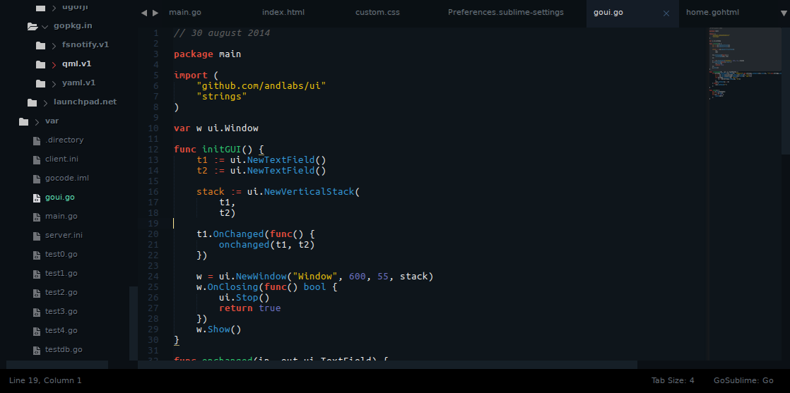
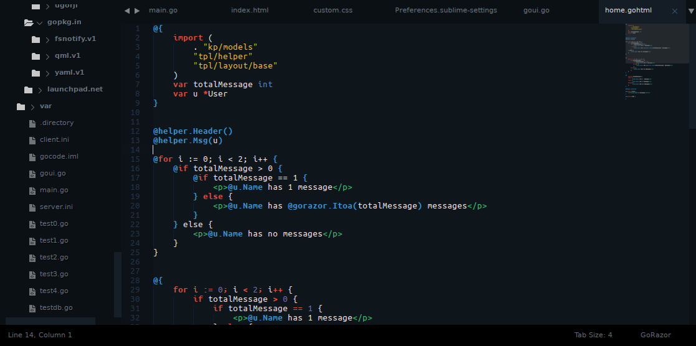

# Glammer

Glammer=[Glacier](http://glaciertheme.com)(by [joeyfigaro](https://github.com/joeyfigaro) [[Twitter](http://twitter.com/joeyfigaro)])+[Brogrammer](https://github.com/kenwheeler/brogrammer-theme)(by [kenwheeler](https://github.com/kenwheeler))






(font shown in screenshots is [Ubuntu Mono](http://font.ubuntu.com/))

## Install

### Manual

1. [Download the .zip](https://github.com/Bluek404/glammer-theme/archive/master.zip)
2. Unzip and rename the folder to `Theme - Glammer`
3. Copy the folder into `Packages` directory, which you can find using the menu item `Preferences -> Browse Packages...` in Sublime Text

## Setup

Activate the UI theme and color scheme by modifying your user preferences file, which you can find using the menu item `Preferences -> Settings - User` in Sublime Text or <kbd>cmd</kbd><kbd>,</kbd> on a Mac.

To change the color of the text input background, open `Glammer.sublime-theme`, search for "widget" and follow the comments.

### Example settings
```
{
	"color_scheme": "Packages/Theme - Glammer/Glammer.tmTheme",
	"theme": "Glammer.sublime-theme"
}

```

### Credits

Most icons are from the fantastic [Spacegray](https://github.com/kkga/spacegray) by [Gadzhi Kharkharov](https://github.com/kkga/) - the folder icon seen in the sidebar is from the talented [Joe Harrison](http://thenounproject.com/joe_harrison/) via [the noun project](http://thenounproject.com/).
